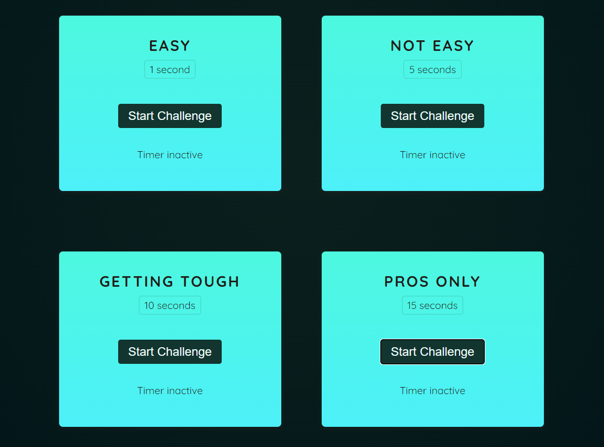
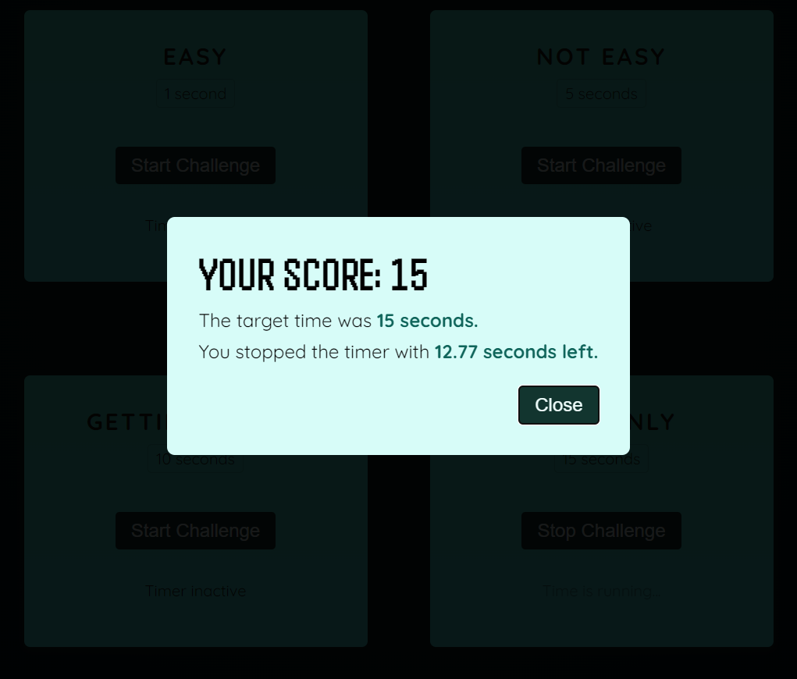
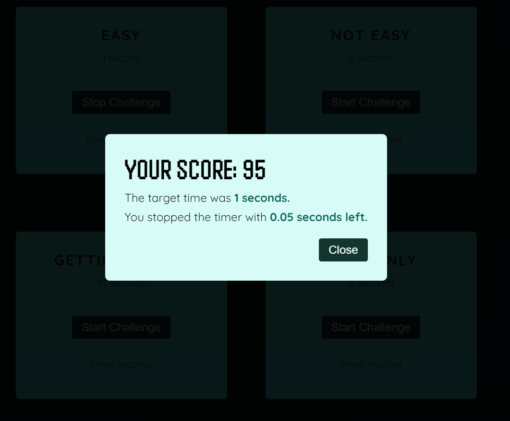

# 타이머 게임 (학습용 프로젝트)
- 주어진 시간이 다 지났을 때의 완벽한 타이밍을 노려 클릭하면 점수를 부여하는 게임
- 모달창을 활용하기 위해 forwardRef, useImperativeHandle 훅을 활용하였다.
- 웹 브라우저 내장 기능인 setInterval 을 활용하여 시간 간격을 계산하여 남은 시간을 점수로 변환하는 로직을 작성하였다.

### 홈 화면

### 게임 진행 (모드 선택에 따라 주어지는 시간이 다름)
;
;